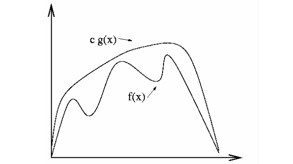
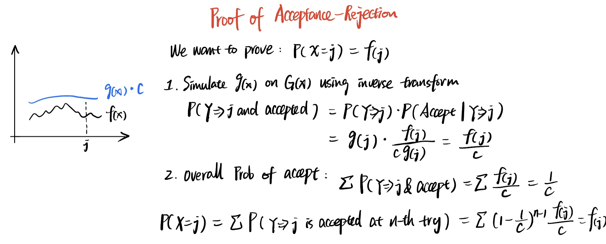

# Statistical Simulation in Finance

## What it is

1. We need to take sample from a distribution
2. Then we use the data to describe our financial process
3. But sometimes the simulation is too computationally expensive, therefore we need variance reduction technique

## Getting Data From a Distribution



### What it is

Use Inverse of CDF to get the x

### Workflow

1. Generate a random number from a uniform distribution
2. Use the inverse function of the CDF to get to the input

### Proof of concept




### What it is

Use a function that covers all the domains \(x\), apply a factor, then based on the ratio to decide whether to keep the record

### Workflow

1. Use Inverse transform to get sample from g\(x\)
2. Use Inverse transform to get a ratio
3. Use the ratio to decide if we keep this sample data

### Proof




### 2 Variable Case

$$
\operatorname{cov}\left(X_{1}, X_{2}\right)=\rho \sigma_{1} \sigma_{2}
$$

By using Cholesky Decomposition, we can get 2 independent variable

$$
Z_{1}=X_{1}, Z_{2}=X_{2}-\rho X_{1}
$$

$$
\text{More precisely: }Z_{1}=X_{1}, \quad Z_{2}=\frac{X_{2}-\rho X_{1}}{\sqrt{1-\rho^{2}}}
$$

Proof

$$
\begin{aligned}
\operatorname{Cov}\left(Z_{1}, Z_{2}\right) &=\operatorname{cov}\left(X_{1}, X_{2}\right)-\rho \operatorname{cov}\left(X_{1}, X_{1}\right) \\
&=\rho-\rho \times 1=0
\end{aligned}
$$



## Variance Reduction Technique





















## Markov Chain Monte Carlo Methods

## Least Square MC

