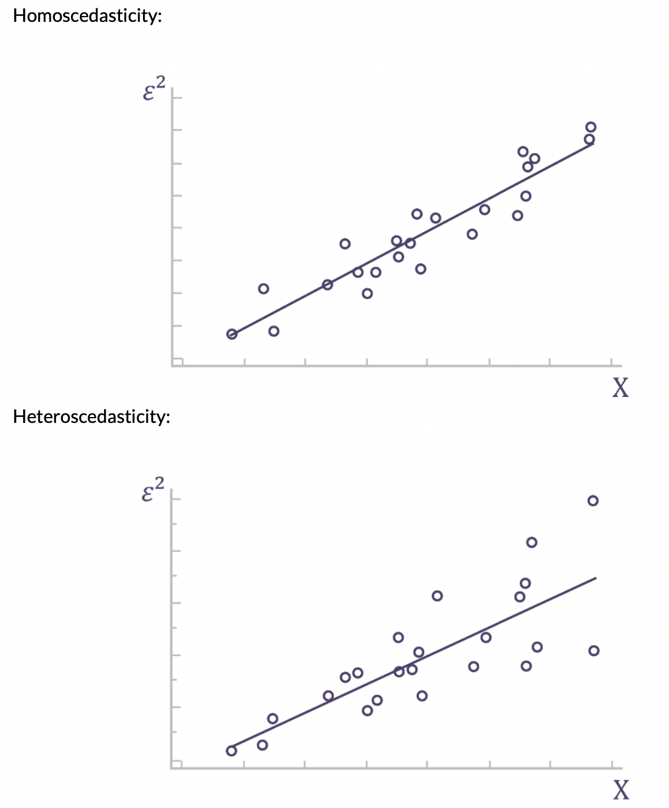

# Linear Regression

## Models



$$P = P_r(y=1|X) = \frac{e^{\alpha + \beta X}}{1+e^{\alpha + \beta X}}$$ 

Odds: $$\frac{P}{1-P} = e^{\alpha + \beta X}$$ 

Ln\(Odds\): $$\alpha + \beta X$$ 









Model: $$\mathrm{y}=\beta_{0}+\beta_{1} \mathrm{x}_{1}+\ldots+\beta_{k} \mathrm{x}_{\mathrm{k}}+\varepsilon^{2}$$ 

Homoscedasticity: $$\operatorname{Var}\left(\varepsilon \mid \mathrm{x}_{1}, \ldots, \mathrm{x}_{\mathrm{k}}\right)=\sigma^{2}$$ 

Heteroscedasticity: $$\operatorname{Var}\left(\varepsilon \mid x_{1}, \ldots, x_{k}\right)=\sigma^{2} \mathrm{f}\left(x_{1}, \ldots, x_{k}\right)$$ 




* Strongly correlated independent variables \(which is not we want\)

How to check it

* Correlation between variables
* VIF: variance inflation factor
  * &gt;5, &gt;10 or average VIF &gt;1 is highly possible to have multicollinearity
  * $$VIF_i = \frac{1}{(1-R_i^2)}$$ 
  * $$Tolerance = \frac{1}{VIF_i}$$ 
* Kappa / Condition number:
  * &gt;30, &gt;15 is highly possible to have multicollinearity
  * $$\frac{\sqrt{\text{max eigen value of }(X^TX)}}{\sqrt{\text{min eigen value of }(X^TX)}}$$ 
* 



* DW Test: check auto-correlation of error terms
* White Test: check homoscedasticity
* Breush-Pagan Lagrange-Multiplier test: check homoscedasticity \(can choose variables to include\)
* 



