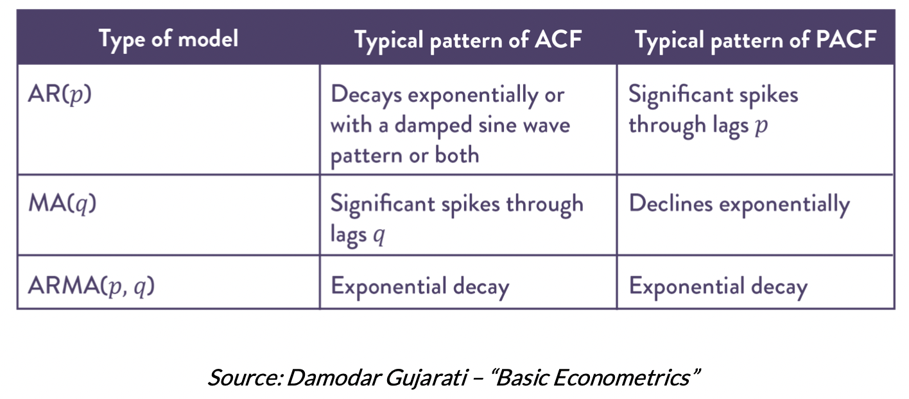
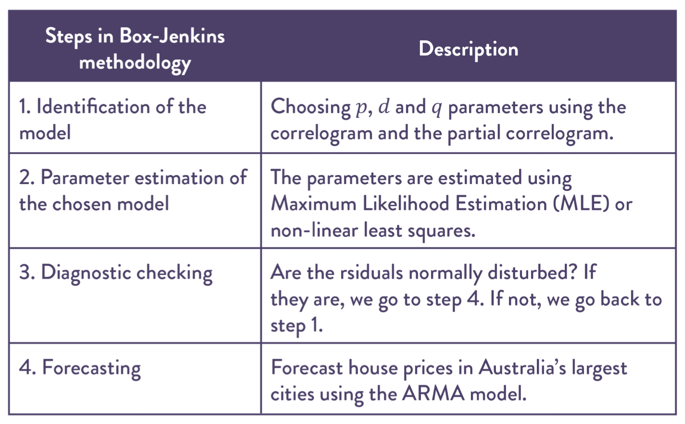

# Basic Concepts

## Preparation Concepts



### Definition: Stationary:

* _**A time series is considered stationary if the values never drift far away from their initial value.**_ A variable that has a finite mean and variance is considered covariance stationary. Stationary time series variables tend to return to their mean after a period of time \(mean-reversion\), and their deviations from the mean tend to be constant \(constant variance\).

### Why we want stationary

* We want time-series to be stationary \(no trend\) because we want to eliminate un-necessary correlation in our analysis.
* If 2 time series both have upward trend, then our analysis will show they are having high correlation while they might have no relationship at all.

### When do stationary appears

* Most financial and macroeconomic variables are not stationary, but in some cases the linear combination of some variables is stationary \(cointegration\). In this case, the variables are said to share the same stochastic trend.
* Some derivatives from the variables can be stationary as well. For instance, prices is usually not stationary, but the log return of prices can be stationary.



### Definition: Auto Correlation

* It is similar to correlation, but the 2 variables are in the same time-series, with k lags apart.
* It measures the linear Pearson correlation between observations **𝑘** time periods \(lags\) apart. If it differs significantly from zero, the serial dependence among the observations must be included as in an MA process



## Definition: 

Similar to Auto Correlation, It measures the linear Pearson correlation between observations **𝑘** time periods \(lags\) apart. But it "partial out" the intervening lags. If it differs significantly from zero, the serial dependence among the observations must be included as in an AR process






$$L^{i} y_{t}=y_{t-i}$$ 

And we have the following properties:

* $$L c=c$$ 
* $$\left(L^{i}+L^{j}\right) y_{t}=L^{I} y_{t}+L^{j} y_{t}=y_{t-j}$$ 
* $$L^{i} L^{j} y_{t}=L^{i}\left(L^{j} y_{t}\right)=L^{i} L^{j} y_{t-j}=y_{t-i-j}$$ 
* $$L^{-i} y_{t}=y_{t+i}$$ 







## Introducint the Model



AR Process

* Autoregressive means that "current value is impacted by past values"
* AR\(1\) means current value is impacted by previous value
  * $$y(T+1)=\alpha+\beta * y(T)$$ 
* AR\(2\) means current value is impacted by previous 2 values

Characteristics:

* The ACF declines exponentially 
* The PACF spikes on the first ****$$p$$ ****lag



MA Process

* Moving Average means that "current value is impacted by previous \(unobserved\) random shocks"
* Note that Moving Average **is not** the average over previous values!
* MA\(q\) means current value is impacted by previous q random shock
  * $$X_{t}=\mu+\varepsilon_{t}+\theta_{1} \varepsilon_{t-1}+\cdots+\theta_{q} \varepsilon_{t-q}$$ 
    * $$\mu \text { is the mean of the series }$$ 
    * $$\varepsilon_{t}, \varepsilon_{t-1}, \ldots, \varepsilon_{t-q} \text { is the white noise error terms }$$
  * $$X_{t}=\mu+\left(1+\theta_{1} B+\ldots+\theta_{q} B^{q}\right) \varepsilon_{t}$$ 

Characteristics:

* The ACF spikes on the first $$q$$ lag 
* The PACF declines exponentially



* An ARMA\(p, q\) can be expressed as:
  * $$y_{t}=a_{0}+\sum_{i=1}^{p} a_{i} y_{t-i}+\sum_{i=0}^{q} \beta_{i} \varepsilon_{t-i}$$ 
* An ARMA\(m, n\) can also be expressed as:
  * $$\begin{aligned} \psi(L)\left(y_{t}-\mu\right) &=\Theta(L) \varepsilon_{t}-\mathrm{ARMA}(m, n) \\ \psi(L) &=1-\sum_{i=1}^{m} \psi_{i} L^{i} \\ \Theta(L) &=1-\sum_{i=1}^{n} \theta_{i} L^{i} \end{aligned}$$ 

Characteristics:

* decline on both ACF and the PACF



ARIMA Process

* Autoregressive integrated moving average: is a combination of both AR and MA
* ARIMA\(p, d, q\)
  * $$p-\text { the order of the autoregressive model }$$ 
  * $$d \text { - the order required to make the variable stationary }$$ 
  * $$q \text { - the order of the moving average model }$$ 
* ARIMA\(1,1,1\) is the same with ARMA\(1,1\), the difference being the fact that the additional parameter in ARIMA indicates what type of updates we have to perform to the data before being introduced in the ARMA model.

Characteristics:

* ACF or PACF declines slowly
* Large number of significant ACF or PACF indicates non-stationarity and need for further differencing








* ARMA is a popular tool in predicting macroeconomic variables like GDP, inflation, industrial production or unemployment
* Provides poor stock return/value forecasts
* Provides better results in spread forecasting
* The forecasts are highly dependent on the latest registered values
* ARMA forecasts can be improved by combining them with results from other models and algorithms. For example, Netflix data analysts obtained better predictions after combining results from different algorithms \(hybrid approach\)
* Adding exogenous variables can improve ARMA predictions \(ARMAX model\)



## Choosing the model



It answer the question: **what model should we use for time series data**

Box-Jenkins method is applied in ARMA/ARIMA models for finding the best fit

$$\begin{array}{l|l} \begin{array}{l} \text { Steps in Box-Jenkins } \\ \text { methodology } \end{array} & \text { Description } \\ \hline \begin{array}{l} \text { 1. Identification of the } \\ \text { model } \end{array} & \begin{array}{l} \text { Choosing } p, d \text { and } q \text { parameters using the } \\ \text { correlogram and the partial correlogram. } \end{array} \\ \hline \begin{array}{l} \text { 2. Parameter estimation of } \\ \text { the chosen model } \end{array} & \begin{array}{l} \text { The parameters are estimated using } \\ \text { Maximum Likelihood Estimation (MLE) or } \\ \text { non-linear least squares. } \end{array} \\ \hline \text { 3. Diagnostic checking } & \begin{array}{l} \text { Are the rsiduals normally disturbed? If } \\ \text { they are, we go to step 4. If not, we go back to } \\ \text { step 1. } \end{array} \\ \hline \text { 4. Forecasting } & \begin{array}{l} \text { Forecast house prices in Australia's largest } \\ \text { cities using the ARMA model. } \end{array} \end{array}$$ 




$$A I C=\text {Tln}(\text {sum of squared residuals})+2 n$$ 



Schwartz Bayesian Criterion: A Bayesian Information Criteria

$$S B S=\text {Tln}(\text {sum of squared residuals})+n \ln (T)$$ 








* ACF/PACF and Information Criterion can indicate different models. So, we must decide on the final model selected.
* SBC has superior large sample properties.
* AIC performs better in small samples than SBC.
* AIC tends to indicate the overparameterized model. In this case, you should check the 𝑡𝑡- statistics of all coefficients to see if they are significant.
* We suggest comparing results/forecasts from different ARMA models \(different 𝑝𝑝 and 𝑞𝑞 values\).
* It is easier to determine 𝑝𝑝 and 𝑞𝑞 parameters using an Information Criterion as compared to the Box Jenkins Method. The interpretation of ACF and PACF is an art and can be subjective.



