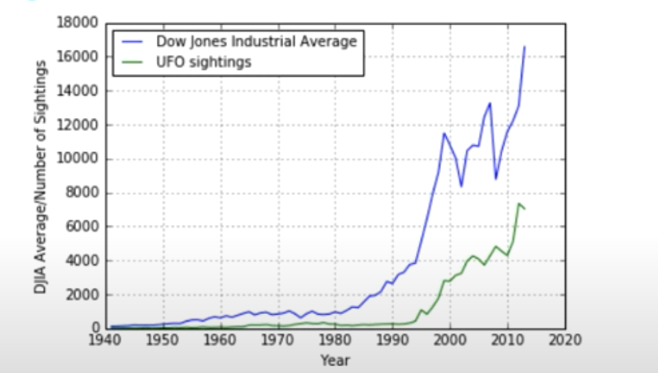

# Common Mistakes in analyzing time series

## Correlation with 2 trending series

For example, 2 upward trending time series can have high correlation even though they have no connection. So when analyzing the correlation, **using correlation for the return of the asset**, instead of merely its level.

